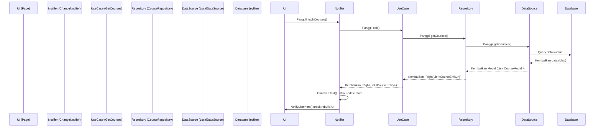

# Sunnova App: Desain Teknis

## 1. Ringkasan (Overview)

Sunnova adalah aplikasi mobile Flutter yang dirancang sebagai platform pembelajaran agama Islam dengan pendekatan gamifikasi. Aplikasi ini bertujuan untuk membuat proses belajar menjadi menarik dan interaktif, mirip dengan platform seperti Duolingo atau SoloLearn. Pengguna dapat mempelajari berbagai topik seperti Makhrojul al-huruf, Tajwid, dan dasar-dasar Islam lainnya melalui kursus terstruktur, kuis, dan tantangan. Elemen gamifikasi seperti Poin Pengalaman (XP), level, streak, lencana (badges), dan papan peringkat (leaderboard) akan diintegrasikan untuk memotivasi pengguna.

Aplikasi ini akan dibangun menggunakan arsitektur yang bersih (Clean Architecture), dapat diuji (testable), dan dapat diskalakan (scalable), dengan mengikuti pedoman teknis yang telah ditentukan.

## 2. Analisis Rinci (Detailed Analysis)

### 2.1. Masalah yang Dipecahkan
Banyak orang ingin belajar dasar-dasar agama Islam tetapi merasa metode tradisional kurang menarik atau sulit diakses. Aplikasi pembelajaran yang ada mungkin tidak memiliki elemen interaktif atau motivasi yang cukup untuk menjaga konsistensi belajar.

### 2.2. Tujuan
- **Edukasi:** Menyediakan konten pembelajaran Islam yang terstruktur, akurat, dan mudah dipahami.
- **Keterlibatan (Engagement):** Meningkatkan motivasi belajar pengguna melalui mekanisme gamifikasi yang komprehensif.
- **Aksesibilitas:** Memberikan platform yang mudah diakses kapan saja dan di mana saja melalui perangkat mobile.

### 2.3. Fitur Inti
1.  **Manajemen Pengguna:** Registrasi, login, dan profil pengguna yang menampilkan progres, level, XP, dan lencana.
2.  **Katalog Kursus:** Daftar kursus yang tersedia (misal: Tajwid, Fiqh Dasar, Sejarah Nabi).
3.  **Pembelajaran Interaktif:** Setiap kursus terdiri dari pelajaran (lessons) yang berisi teks, gambar, dan mungkin audio/video.
4.  **Kuis:** Kuis di akhir setiap pelajaran atau kursus untuk menguji pemahaman.
5.  **Mesin Gamifikasi:**
    - **XP & Level:** Pengguna mendapatkan XP setelah menyelesaikan pelajaran/kuis untuk naik level.
    - **Streak:** Menghitung hari belajar berturut-turut.
    - **Lencana (Badges):** Penghargaan virtual untuk pencapaian tertentu (misal: menyelesaikan kursus pertama).
    - **Papan Peringkat (Leaderboard):** Peringkat pengguna berdasarkan XP yang didapat dalam periode waktu tertentu.
6.  **Penyimpanan Lokal:** Progres pengguna akan disimpan secara lokal di perangkat untuk penggunaan offline.

## 3. Alternatif yang Dipertimbangkan

-   **Manajemen State (State Management):**
    - **Pilihan:** `ChangeNotifier` dengan `Provider`.
    - **Alasan:** Sesuai dengan permintaan pengguna. `ChangeNotifier` lebih sederhana dan cocok untuk state yang tidak terlalu kompleks. Penggunaan `Consumer` dan `Selector` yang tepat akan memastikan performa tetap terjaga dengan menghindari rebuild widget yang tidak perlu.

-   **Database Lokal:**
    - **Pilihan:** `sqflite` (SQL).
    - **Alasan:** Sesuai permintaan pengguna. `sqflite` sangat baik untuk data yang terstruktur dan relasional seperti pengguna, kursus, dan progres, yang merupakan inti dari aplikasi ini.

## 4. Desain Rinci (Detailed Design)

### 4.1. Arsitektur: Clean Architecture
Aplikasi akan dibagi menjadi tiga lapisan utama, dengan dependensi yang mengalir ke dalam (Presentation -> Domain <- Data).

```
lib/
├── core/
│   ├── error/
│   │   ├── exceptions.dart
│   │   └── failures.dart
│   ├── usecases/
│   │   └── usecase.dart
│   └── db/
│       └── database_helper.dart
│
├── features/
│   └── <feature_name>/
│       ├── data/
│       │   ├── datasources/
│       │   │   └── <feature_name>_local_data_source.dart
│       │   ├── models/
│       │   │   └── <feature_name>_model.dart
│       │   └── repositories/
│       │       └── <feature_name>_repository_impl.dart
│       │
│       ├── domain/
│       │   ├── entities/
│       │   │   └── <feature_name>_entity.dart
│       │   ├── repositories/
│       │   │   └── <feature_name>_repository.dart (abstract)
│       │   └── usecases/
│       │       └── get_<feature_name>.dart
│       │
│       └── presentation/
│           ├── notifiers/ (ChangeNotifier)
│           │   └── <feature_name>_notifier.dart
│           ├── pages/
│           │   └── <feature_name>_page.dart
│           └── widgets/
│               └── <feature_name>_widget.dart
│
├── injection_container.dart
└── main.dart
```

### 4.2. Diagram Alur Data (Data Flow)
Berikut adalah contoh alur data ketika pengguna meminta daftar kursus.



### 4.3. Komponen Inti

#### 4.3.1. Lapisan Domain (Domain Layer)
-   **Entities:** Plain Dart Objects (POCOs) menggunakan class biasa untuk immutable nya
    -   `UserEntity`: { id, name, email, xp, level, streak }
    -   `CourseEntity`: { id, title, description, iconUrl }
    -   `LessonEntity`: { id, courseId, title, content }
    -   `QuizEntity`: { id, lessonId, question, options, correctOptionIndex }
    -   `BadgeEntity`: { id, name, description, imageUrl }
-   **Repositories (Abstract):** Kontrak yang akan diimplementasikan oleh lapisan data.
    -   `UserRepository`: `Future<Either<Failure, UserEntity>> getUser(String id);`
    -   `CourseRepository`: `Future<Either<Failure, List<CourseEntity>>> getCourses();`
-   **UseCases:** Merepresentasikan satu tugas spesifik dari aplikasi.
    -   `GetCourses(CourseRepository repository)`
    -   `GetUserProfile(UserRepository repository)`
    -   `SubmitQuizAnswer(QuizRepository repository)`

#### 4.3.2. Lapisan Data (Data Layer)
-   **Models:** Juga dibuat dengan class biasa tapi immutable untuk serialisasi dari/ke database dan (di masa depan) API.
    -   `UserModel`, `CourseModel`, dll.
-   **Repositories (Implementation):** Implementasi dari repositori domain.
    -   `CourseRepositoryImpl`: Akan memanggil `LocalDataSource`. Di dalamnya, akan ada blok `try-catch` untuk menangkap `Exception` dan mengembalikannya sebagai `Left<Failure>`.
-   **DataSources:**
    -   `CourseLocalDataSource`: Berinteraksi langsung dengan `DatabaseHelper` untuk melakukan operasi CRUD pada tabel kursus.
-   **DataDummy:**
    -   gunakan data dummy dari seeder jangan hardcode di repository implementasi.

#### 4.3.3. Lapisan Presentasi (Presentation Layer)
-   **Notifiers (`ChangeNotifier`):** Mengelola state untuk setiap layar/fitur.
    -   `CourseNotifier`: Memanggil `GetCourses` use case, mengelola state (misal: `loading`, `loaded`, `error`), dan mengekspos data kursus ke UI. 
    -   Contoh State: `CourseState` dengan varian `initial()`, `loading()`, `loaded(List<CourseEntity> courses)`, `error(String message)`.
-   **Pages/Widgets:**
    -   Menggunakan `ChangeNotifierProvider` untuk menyediakan `Notifier` ke widget tree.
    -   Menggunakan `Consumer<MyNotifier>` atau `context.watch<MyNotifier>()` untuk mendengarkan perubahan state dan membangun ulang UI.
    -   Memanggil metode pada `Notifier` untuk memicu aksi pengguna (misal: `Provider.of<CourseNotifier>(context, listen: false).fetchCourses();`).

### 4.4. Penanganan Error (Error Handling)
-   Akan menggunakan tipe `Either<Failure, T>` dari paket `dartz`.
-   **`core/error/exceptions.dart`**: Mendefinisikan `Exception` kustom (misal: `DatabaseException`). `DataSource` akan melempar `Exception` ini.
-   **`core/error/failures.dart`**: Mendefinisikan kelas `Failure` abstrak dan turunannya (misal: `DatabaseFailure`). `Repository` akan menangkap `Exception` dan memetakannya ke `Failure`, lalu mengembalikannya sebagai `Left<Failure>`.
-   `Notifier` akan menggunakan metode `.fold()` pada hasil `Either` untuk menangani kasus sukses (`Right`) dan gagal (`Left`) secara eksplisit.

### 4.5. Skema Database (Database Schema)
Berikut adalah desain awal skema database `sqflite`.

## 👤 1. User & Authentication

### **Entity: UserProfile**

| Field | Type | Deskripsi |
|--------|------|-----------|
| uid | String | 🔑 Primary key (Firebase Auth ID) |
| email | String? | Email pengguna |
| displayName | String? | Nama tampilan |
| photoURL | String? | URL foto profil |
| gender | String? | Untuk personalisasi konten |
| fcmToken | String? | Token notifikasi push |
| isPremium | bool | Status langganan |
| createdAt | DateTime | Tanggal akun dibuat |
| lastLoginAt | DateTime? | Terakhir login |

---

## 📘 2. Content & Modules

### **Entity: CourseModule**

| Field | Type | Deskripsi |
|--------|------|-----------|
| id | String | 🔑 Primary key |
| title | String | Judul modul (ex: Tajwid Dasar) |
| description | String | Deskripsi singkat modul |
| icon | String | Ikon modul |
| ordering | int | Urutan tampil di dashboard |
| requiredXpToUnlock | int | XP minimum untuk membuka |
| isLocked | bool | Status terkunci |
| createdAt | DateTime | Tanggal dibuat |
| updatedAt | DateTime? | Tanggal diupdate |

---

### **Entity: LessonUnit**

| Field | Type | Deskripsi |
|--------|------|-----------|
| id | String | 🔑 Primary key |
| moduleId | String | 🔗 FK ke `CourseModule` |
| title | String | Nama unit (contoh: Hukum Nun Sukun) |
| description | String | Deskripsi unit |
| ordering | int | Urutan di dalam modul |
| requiredLevel | int? | Level minimum pembuka |
| isLocked | bool | Status terkunci |
| createdAt | DateTime | Tanggal dibuat |
| updatedAt | DateTime? | Tanggal diupdate |

---

### **Entity: ContentLesson**

| Field | Type | Deskripsi |
|--------|------|-----------|
| id | String | 🔑 Primary key |
| unitId | String | 🔗 FK ke `LessonUnit` |
| title | String | Judul pelajaran |
| content | String | Konten teks (markdown/html) |
| videoUrl | String? | URL video pembelajaran |
| audioUrl | String? | URL audio contoh |
| ordering | int | Urutan dalam unit |
| requiredTimeInSeconds | int | Estimasi waktu belajar |
| xpReward | int | XP reward setelah selesai |
| createdAt | DateTime | Tanggal dibuat |
| updatedAt | DateTime? | Tanggal diupdate |

---

## 🧭 3. Gamification & Progress

### **Entity: UserGameStats**

| Field | Type | Deskripsi |
|--------|------|-----------|
| userId | String | 🔗 FK ke `UserProfile` |
| totalXp | int | Total XP user |
| level | int | Level saat ini |
| currentStreak | int | Hari aktif beruntun |
| longestStreak | int | Rekor streak |
| lastActiveDate | DateTime? | Terakhir aktif |
| totalLessonsCompleted | int | Jumlah pelajaran selesai |
| totalQuizzesPassed | int | Jumlah kuis lulus |
| createdAt | DateTime | Dibuat |
| updatedAt | DateTime? | Diperbarui |

---

### **Entity: UserLessonProgress**

| Field | Type | Deskripsi |
|--------|------|-----------|
| id | String | 🔑 Primary key |
| userId | String | 🔗 FK ke `UserProfile` |
| lessonId | String | 🔗 FK ke `ContentLesson` |
| isCompleted | bool | Status penyelesaian |
| completedAt | DateTime? | Waktu selesai |
| attempts | int | Jumlah percobaan |
| quizScore | double? | Skor kuis terakhir |
| createdAt | DateTime | Dibuat |
| updatedAt | DateTime? | Diperbarui |

---

### **Entity: BadgeEntity**

| Field | Type | Deskripsi |
|--------|------|-----------|
| id | String | 🔑 Primary key |
| title | String | Nama badge/pencapaian |
| description | String | Deskripsi badge |
| icon | String | Ikon |
| targetValue | int | Nilai target (contoh: 10 lesson) |
| gemReward | int | Reward Gems |
| createdAt | DateTime | Dibuat |
| updatedAt | DateTime? | Diperbarui |

---

### **Entity: UserAchievement**

| Field | Type | Deskripsi |
|--------|------|-----------|
| id | String | 🔑 Primary key |
| userId | String | 🔗 FK ke `UserProfile` |
| badgeId | String | 🔗 FK ke `BadgeEntity` |
| unlockedAt | DateTime | Waktu pencapaian |
| isNew | bool | Untuk notifikasi baru |

---

### **Entity: LeaderboardRank**

| Field | Type | Deskripsi |
|--------|------|-----------|
| rankType | String | WEEKLY / MONTHLY |
| userId | String | 🔗 FK ke `UserProfile` |
| scoreValue | int | Nilai ranking |
| rank | int | Peringkat |
| createdAt | DateTime | Dibuat |

---

### **Entity: AssessmentQuestion**

| Field | Type | Deskripsi |
|--------|------|-----------|
| id | String | 🔑 Primary key |
| lessonId | String | 🔗 FK ke `ContentLesson` |
| question | String | Pertanyaan |
| options | List<String> | Pilihan jawaban |
| correctAnswerIndex | int | Index jawaban benar |
| explanation | String | Penjelasan jawaban |
| difficultyLevel | int | Tingkat kesulitan |
| ordering | int | Urutan pertanyaan |
| createdAt | DateTime | Dibuat |
| updatedAt | DateTime? | Diperbarui |

---

### **Entity: UserAnswerLog**

| Field | Type | Deskripsi |
|--------|------|-----------|
| id | String | 🔑 Primary key |
| userId | String | 🔗 FK ke `UserProfile` |
| questionId | String | 🔗 FK ke `AssessmentQuestion` |
| selectedAnswerIndex | int | Jawaban dipilih |
| isCorrect | bool | Benar/salah |
| isHintUsed | bool | Apakah menggunakan hint |
| attemptedAt | DateTime | Waktu percobaan |


## 5. Ringkasan Desain

Desain ini mengadopsi **Clean Architecture** untuk memisahkan logika bisnis, UI, dan data, sehingga menghasilkan aplikasi yang modular, mudah diuji, dan mudah dipelihara.
-   **State Management** menggunakan `ChangeNotifier` yang sederhana namun kuat.
-   **Data** disimpan secara lokal dalam database relasional `sqflite`.
-   **Model data** yang immutable dan aman (type-safe).
-   **Error handling** yang eksplisit dan fungsional diimplementasikan dengan `dartz Either`.

Pendekatan ini memenuhi semua persyaratan teknis dan meletakkan fondasi yang kokoh untuk pengembangan fitur-fitur di masa depan.

## 6. Referensi

-   Struktur Folder Clean Architecture: [https://www.youtube.com/watch?v=KjE2IDphA_U](https://www.youtube.com/watch?v=KjE2IDphA_U)
-   Tutorial `ChangeNotifier` dengan `Provider`: [https://docs.flutter.dev/data-and-backend/state-mgmt/simple](https://docs.flutter.dev/data-and-backend/state-mgmt/simple)
-   Implementasi `sqflite` Local Data Source: [https://docs.flutter.dev/cookbook/persistence/sqlite](https://docs.flutter.dev/cookbook/persistence/sqlite)
-   Error Handling dengan `dartz Either`: [https://resocoder.com/2019/09/22/flutter-clean-architecture-series-part-5-error-handling-either-failure/](https://resocoder.com/2019/09/22/flutter-clean-architecture-series-part-5-error-handling-either-failure/)